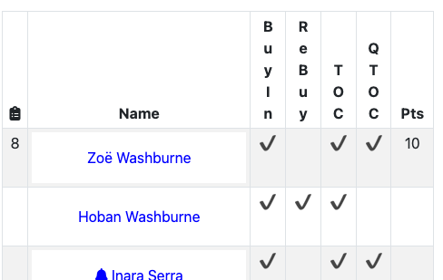
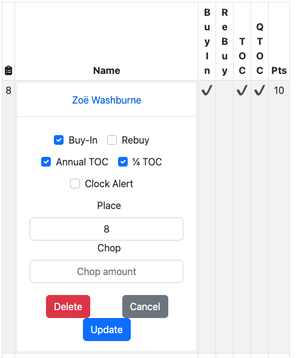

# React Performance

## The Motivation
I was working on the react UI for tracking a poker game. The screen shows a list of players

Selecting the name of a player brings up a modal dialog to edit the player

Cancelling the dialog does not change any values for the player. 

The question I wanted to answer is: why is it that each react component in the list of players rerenders?

## Ways to see if a component renders
I started tracking if a component renders by adding *console.log('...')* statements in the rendering of the react component. 
That got quickly became tedious. I then installed the React DevTools to use the profilier.

[Introducing the React Profiler](https://legacy.reactjs.org/blog/2018/09/10/introducing-the-react-profiler.html)

# Steps
## step 04 flesh out readme
Fleshed out all of the readme content about these list of steps

## step 03 render state
Parent component that either
* has state
* uses custom hook
* is a context provider
with children components and a modal dialog.

The children are duplicated using React.memo.

Which children rerender when the modal dialog is dismissed?

Look the the react devtools flamegraph to see why a child rerendered.

## step 02 react router
Added the react routing dependency.
* _npm i --save react-router-dom_

## step 01 add bootstrap
Added the react-bootstrap dependency
* _npm install --save react-bootstrap bootstrap_

Imported the bootstrap css

    import 'bootstrap/dist/css/bootstrap.min.css';

Coded a simple bootstrap Container in the App component.

## step 00 create development environment
To get started did the following.

Using the following versions
* node: 18.12.1
* npm: 8.19.2

Create the react app
* _npx create-react-app react-performance_
* _cd react-performance_

Removed the .git directory
* _rm -rf .git_

Created github repository react-performance

Hook up react-performance with the github repository
* _git init _
* _git add ._
* _git commit -m "app created with create-react-app"_
* _git remote add origin git@github.com:gpratte/react-performance.git_
* _git push origin master_

Make sure the initial react application works. Should see the default react page in the web browser at http://localhost:3000/
* _npm start_

Create the first branch
* _git checkout -b step-00-create-development-environment_
* _git push origin step-00-create-development-environment_
